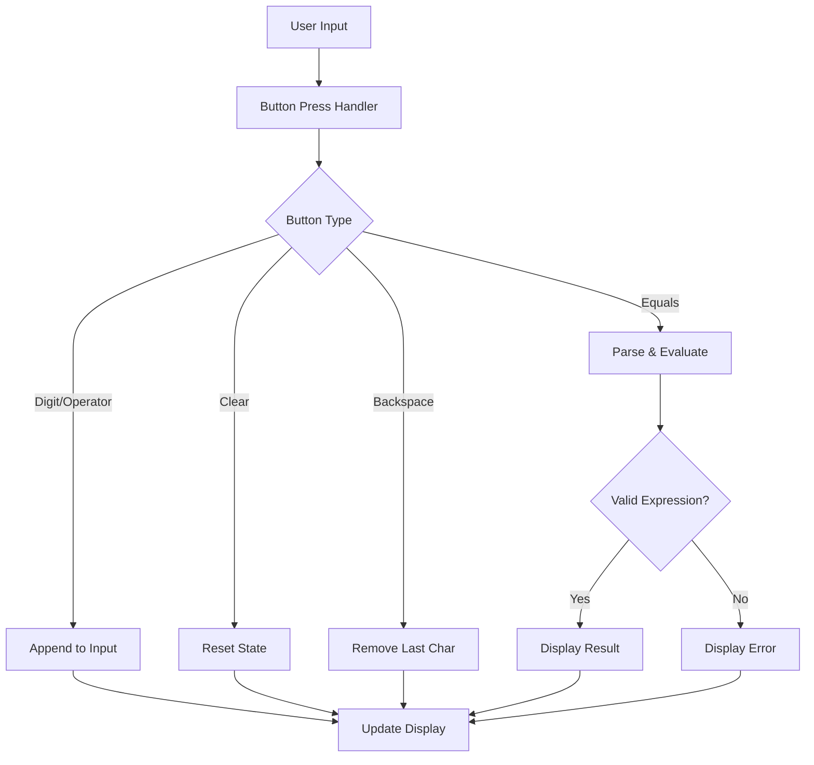

# Design Document

## Overview

This design modernizes the Calculator app with Material Design 3 aesthetics while fixing the deprecated Parser API usage. The update focuses on visual improvements, code quality, and maintaining robust calculation functionality.

## Architecture

The app follows a simple single-file architecture appropriate for its scope:

```
lib/
└── main.dart          # Entry point, UI, and calculation logic
```

The architecture uses Flutter's StatefulWidget pattern with `setState` for state management, which is appropriate for this simple calculator application.

### Component Flow



## Components and Interfaces

### CalculatorApp (StatefulWidget)

The main application widget containing all UI and logic.

**State Variables:**
- `input: String` - Current expression being built
- `output: String` - Result of calculation or error message

**Methods:**
- `onButtonPressed(String value)` - Handles all button interactions
- `evaluateExpression()` - Parses and evaluates the mathematical expression
- `buildButton(String text, {Color? bgColor, Color? textColor})` - Creates styled calculator buttons

### Button Categories

| Category | Buttons | Color Scheme |
|----------|---------|--------------|
| Numbers | 0-9, . | Surface variant |
| Operators | +, -, ×, ÷ | Primary color |
| Functions | C, ⌫, (, ) | Secondary container |
| Equals | = | Primary container |

## Data Models

### Calculator State

```dart
class CalculatorState {
  final String input;      // Current expression (e.g., "12+34")
  final String output;     // Result or "0" or "Error"
}
```

### Expression Evaluation

Uses `math_expressions` library with `GrammarParser`:

```dart
// Input transformation
String sanitizedInput = input
    .replaceAll('×', '*')
    .replaceAll('÷', '/');

// Parsing and evaluation
GrammarParser parser = GrammarParser();
Expression exp = parser.parse(sanitizedInput);
double result = exp.evaluate(EvaluationType.REAL, ContextModel());
```

## Correctness Properties

*A property is a characteristic or behavior that should hold true across all valid executions of a system-essentially, a formal statement about what the system should do. Properties serve as the bridge between human-readable specifications and machine-verifiable correctness guarantees.*

### Property 1: Input Appending Preserves Order

*For any* sequence of button presses (digits, operators, parentheses, decimal), the resulting input string SHALL contain those characters in the exact order they were pressed.

**Validates: Requirements 1.1, 1.2**

### Property 2: Clear Resets to Initial State

*For any* calculator state (any input string, any output value), pressing the clear button SHALL result in input being empty string and output being "0".

**Validates: Requirements 2.1**

### Property 3: Backspace Removes Last Character

*For any* non-empty input string, pressing backspace SHALL result in an input string that is the original string with the last character removed.

**Validates: Requirements 2.2**

### Property 4: Valid Expression Evaluation

*For any* valid mathematical expression composed of digits, operators (+, -, *, /), parentheses, and decimal points, evaluating the expression SHALL produce the mathematically correct result.

**Validates: Requirements 1.3**

### Property 5: Invalid Expression Error Handling

*For any* invalid mathematical expression (unbalanced parentheses, consecutive operators, etc.), evaluating the expression SHALL display "Error" without crashing.

**Validates: Requirements 3.1, 6.2**

### Property 6: Result Formatting

*For any* calculation result that is a whole number, the output SHALL display without a decimal point. For any result with a fractional component, the output SHALL display with the decimal portion.

**Validates: Requirements 5.3**

## Error Handling

| Error Condition | Detection | User Feedback |
|-----------------|-----------|---------------|
| Invalid expression | Parser throws exception | Display "Error" |
| Division by zero | Result is Infinity/NaN | Display "Error" |
| Empty input evaluation | Check before parsing | Display "0" |

All errors are caught in a try-catch block, ensuring the app never crashes from user input.

## Testing Strategy

### Property-Based Testing

The project will use the `dart_quickcheck` or `glados` package for property-based testing in Dart/Flutter.

**Configuration:**
- Minimum 100 iterations per property test
- Each test tagged with format: `**Feature: calculator-modernization, Property {number}: {property_text}**`

**Properties to Test:**
1. Input appending order preservation
2. Clear state reset
3. Backspace character removal
4. Expression evaluation correctness
5. Error handling for invalid expressions
6. Result formatting (integer vs decimal display)

### Unit Testing

Unit tests will cover:
- Specific calculation examples (e.g., "2+2" = "4")
- Edge cases (empty input, single digit, division by zero)
- Button press sequences

### Test File Structure

```
test/
├── widget_test.dart           # Existing widget tests
├── calculator_logic_test.dart # Unit tests for calculation logic
└── calculator_property_test.dart # Property-based tests
```

## UI Design

### Color Scheme (Material Design 3)

**Dark Theme:**
- Background: `Color(0xFF1C1C1E)` - Near black
- Surface: `Color(0xFF2C2C2E)` - Dark gray for buttons
- Primary: `Color(0xFFFF9500)` - Orange for operators
- Secondary: `Color(0xFF636366)` - Gray for functions
- On Surface: `Colors.white` - Text color

**Light Theme:**
- Background: `Color(0xFFF2F2F7)` - Light gray
- Surface: `Colors.white` - White for buttons
- Primary: `Color(0xFFFF9500)` - Orange for operators
- Secondary: `Color(0xFFE5E5EA)` - Light gray for functions
- On Surface: `Colors.black` - Text color

### Button Styling

```dart
// Modern button with Material 3 styling
ElevatedButton(
  style: ElevatedButton.styleFrom(
    shape: RoundedRectangleBorder(
      borderRadius: BorderRadius.circular(16),
    ),
    padding: EdgeInsets.all(24),
    elevation: 0,
    backgroundColor: buttonColor,
  ),
  // ...
)
```

### Layout

```
┌─────────────────────────────┐
│                             │
│              Input Display  │  ← Smaller, secondary text
│                    Result   │  ← Larger, primary text
│                             │
├───────┬───────┬───────┬─────┤
│   C   │   ⌫   │   (   │  )  │  ← Function row
├───────┼───────┼───────┼─────┤
│   7   │   8   │   9   │  ÷  │
├───────┼───────┼───────┼─────┤
│   4   │   5   │   6   │  ×  │
├───────┼───────┼───────┼─────┤
│   1   │   2   │   3   │  -  │
├───────┼───────┼───────┼─────┤
│   0   │   .   │   =   │  +  │
└───────┴───────┴───────┴─────┘
```
